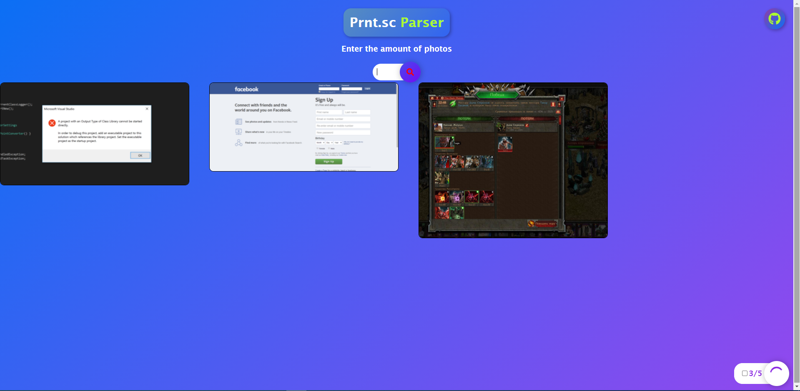

<h1 align="center">Prnt.sc Parser</h1>

## Description
Fullstack project which parse images from site prnt.sc and shows them on client



## Technologies

- [Vue3](https://v3.vuejs.org/)

- [Vuex](https://vuex.vuejs.org/)

- [Express](https://expressjs.com/)

## Installation

```bash
# backend dependencies
$ npm install
```

```bash
# frontend/client dependencies
$ npm install
```

## Running the app

### Backend:

```bash
# backend development
$ npm run start

```

### Frontend:

```bash
# frontend/client development
$ npm run serve
```

# Todo

- [X] Add checkbox for scrolling
- [ ] Style scrolling checkbox
- [X] Mobile version
- [ ] Scroll down button

